# HACK SQL 1

## Hack 1

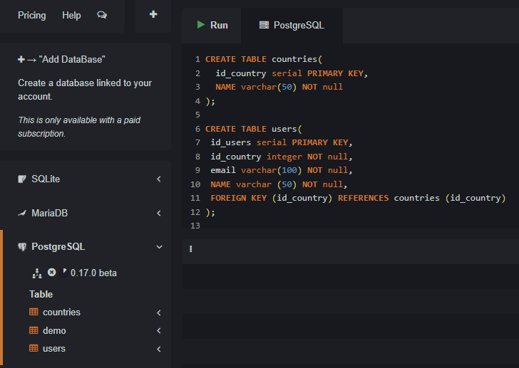

    create table countries(
    id_country serial primary key,
    name varchar(50) not null
    );

    create table users(
    id_users serial primary key,
    id_country integer not null,
    email varchar(100) not null,
    name varchar (50) not null,
    foreign key (id_country) references countries (id_country)
    );

## Hack 2

#### CREATE

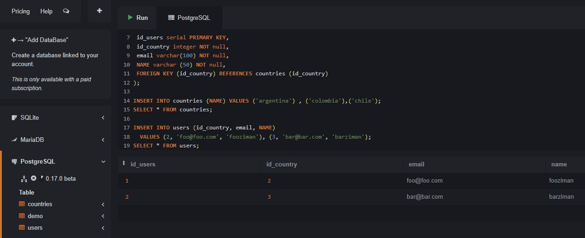

    insert into countries (name) values ('argentina') , ('colombia'),('chile');
    select * from countries;

    insert into users (id_country, email, name)
      values (2, 'foo@foo.com', 'fooziman'), (3, 'bar@bar.com', 'barziman');
    select * from users;

#### DELETE

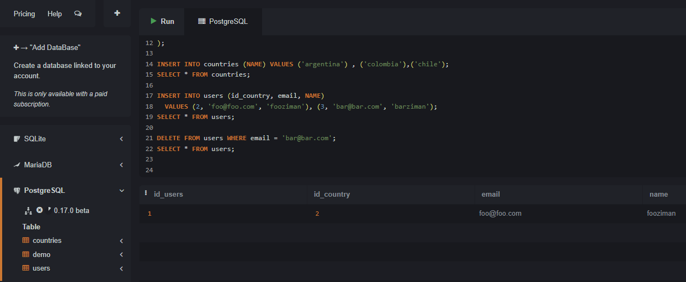

    delete from users where email = 'bar@bar.com';
    select * from users;

#### UPDATE

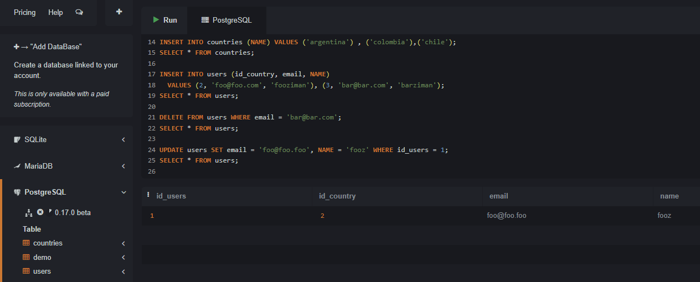

    update users set email = 'foo@foo.foo', name = 'fooz' where id_users = 1;
    select * from users;

#### SELECT

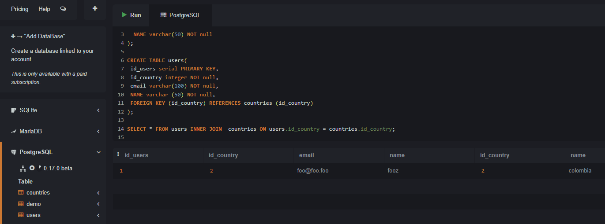

    select * from users inner join  countries on users.id_country = countries.id_country;

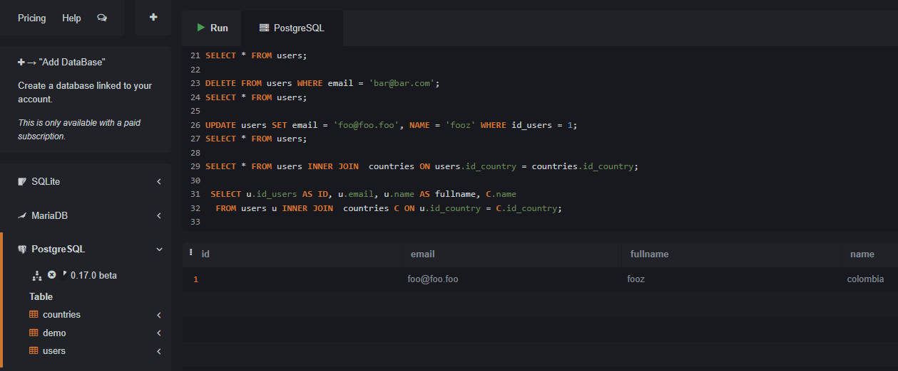

    select u.id_users as id, u.email, u.name as fullname, c.name
    from users u inner join countries c on u.id_country = c.id_country;

## Hack 3

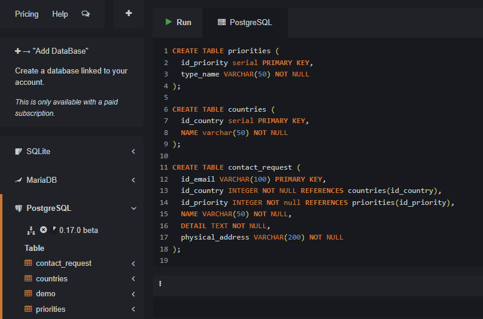

    create table priorities (
    id_priority serial primary key,
    type_name VARCHAR(50) NOT NULL
    );

    CREATE TABLE countries (
      id_country serial PRIMARY key,
      name varchar(50) not NULL
    );

    create table contact_request (
    id_email VARCHAR(100) PRIMARY key,
    id_country INTEGER not NULL REFERENCES countries(id_country),
    id_priority INTEGER not null REFERENCES priorities(id_priority),
    name VARCHAR(50) not NULL,
    DETAIL TEXT NOT NULL,
    physical_address VARCHAR(200) NOT NULL

);

## Hack 4

#### INSERT COUNTRIES

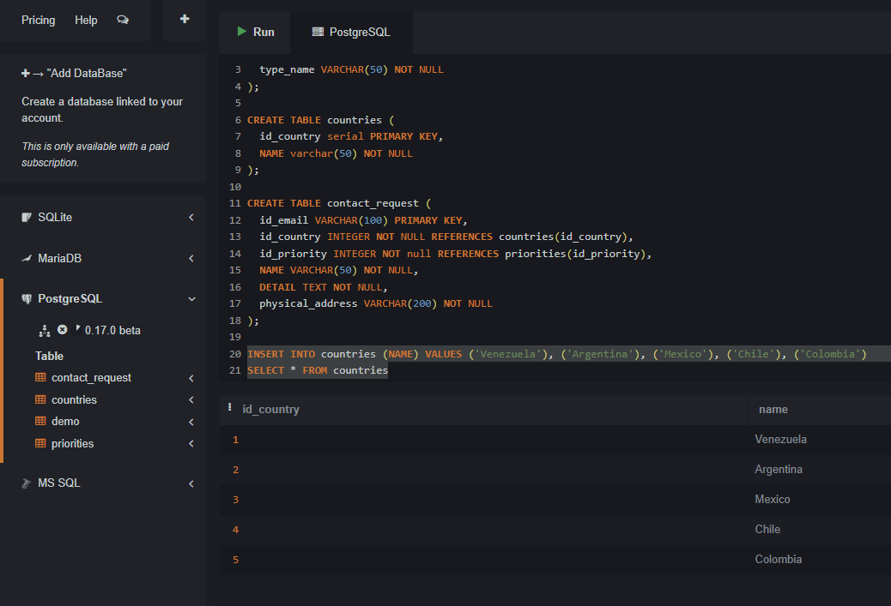

    insert into countries (name) values ('Venezuela'), ('Argentina'), ('Mexico'), ('Chile'), ('Colombia');
    SELECT * from countries;

#### INSERT PRIORITIES

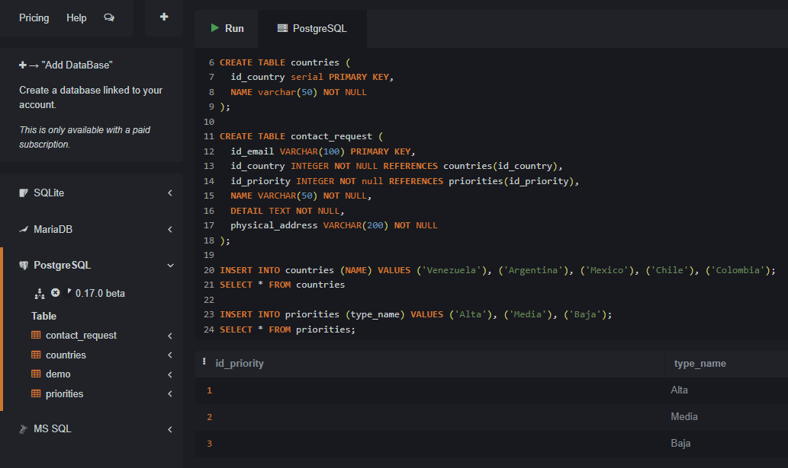

    INSERT INTO priorities (type_name) VALUES ('Alta'), ('Media'), ('Baja');
    select * from priorities;

#### INSERT CONTACT REQUEST

    insert into contact_request (id_email, id_country, id_priority, name, detail, physical_address)
      VALUES ('foo@example.com', 1, 1, 'foo', 'Problema urgente','Address one'),
        ('bar@example.com', 2, 2, 'bar', 'Consulta','Address two'),
        ('qux@example.com', 2, 2, 'qux', 'Error','Address three');

    SELECT * from contact_request;

#### DELETE

    delete from contact_request where id_email = 'qux@example.com'
    SELECT * from contact_request

#### UPDATE

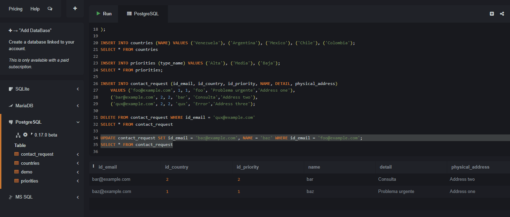

    UPDATE contact_request set id_email = 'baz@example.com', name = 'baz' where id_email = 'foo@example.com';
    SELECT * from contact_request

## Hack 5

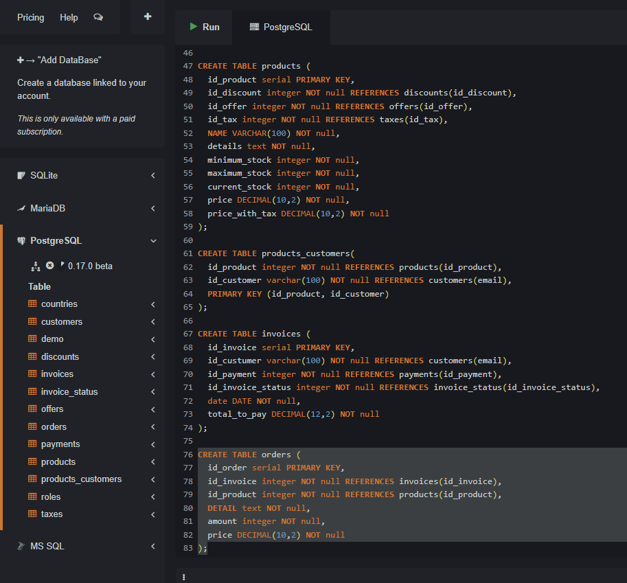

    CREATE table countries (
    id_country serial primary KEY,
    name VARCHAR(50) not null
    );

    CREATE TABLE roles (
    id_role serial primary key,
    name VARCHAR(50) not null
    );

    create table taxes (
    id_tax serial PRIMARY key,
    percentage DECIMAL(5,2) not null
    );

    CREATE table offers (
    id_offer serial primary key,
    status VARCHAR(50) not null
    );

    create table discounts (
    id_discount serial PRIMARY key,
    status VARCHAR(50) not null,
    percentage DECIMAL(5,2) not null
    );

    create table payments (
    id_payment serial primary key,
    type varchar(50) not null
    );

    create table invoice_status (
    id_invoice_status serial PRIMARY key,
    status VARCHAR(50) not null
    );

    create table customers (
    email varchar(100) PRIMARY key,
    id_country integer not null REFERENCES countries(id_country),
    id_role integer not null references roles(id_role),
    name varchar(50) not null,
    age integer not null,
    password VARCHAR(100) not null,
    physical_address VARCHAR(100) not null
    );

    create table products (
    id_product serial PRIMARY key,
    id_discount integer not null references discounts(id_discount),
    id_offer integer not null references offers(id_offer),
    id_tax integer not null references taxes(id_tax),
    name VARCHAR(100) not null,
    details text not null,
    minimum_stock integer not null,
    maximum_stock integer not null,
    current_stock integer not null,
    price DECIMAL(10,2) not null,
    price_with_tax DECIMAL(10,2) not null
    );

    create table products_customers(
    id_product integer not null REFERENCES products(id_product),
    id_customer varchar(100) not null references customers(email),
    PRIMARY KEY (id_product, id_customer)
    );

    create table invoices (
    id_invoice serial primary key,
    id_custumer varchar(100) not null references customers(email),
    id_payment integer not null references payments(id_payment),
    id_invoice_status integer not null references invoice_status(id_invoice_status),
    date DATE not null,
    total_to_pay DECIMAL(12,2) not null
    );

    create table orders (
    id_order serial PRIMARY key,
    id_invoice integer not null references invoices(id_invoice),
    id_product integer not null references products(id_product),
    detail text not null,
    amount integer not null,
    price DECIMAL(10,2) not null
    );

## HACK 6

#### INSERT

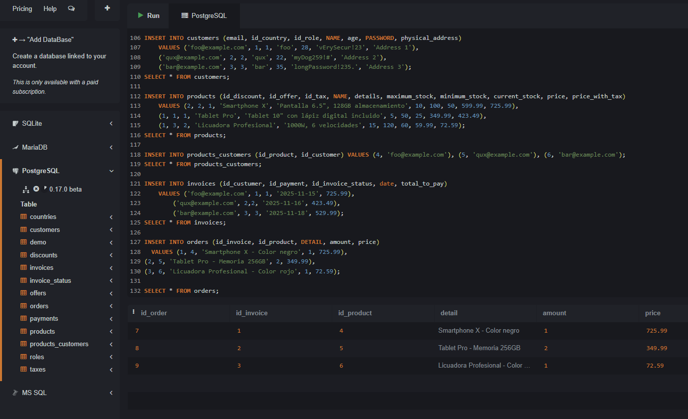

    insert into countries (name) values ('Francia'), ('España'), ('Reino Unido');
    select * from countries

    insert into roles (name) values ('Administrador'), ('Cliente'), ('Vendedor');
    SELECT * from roles

    insert into taxes (percentage) values (10.00), (21.00), (12.00);
    select * from taxes;

    insert into offers (status) values ('Activa'), ('Inactiva'), ('Expirada');
    SELECT * from offers;

    insert into discounts (status, percentage) VALUES ('Activo', 10.00), ('Inactivo', 15.00), ('Expirado', 20.00);
    select * from discounts;

    insert into payments (type) values ('Tarjeta de Credito'),('Tarjeta de Debito'), ('PayPal');
    select *  from payments;

    insert into invoice_status (status) values ('Pendiente'), ('Pagada'), ('Cancelada');
    select * from invoice_status;

    insert into customers (email, id_country, id_role, name, age, password, physical_address)
      values ('foo@example.com', 1, 1, 'foo', 28, 'vErySecur!23', 'Address 1'),
        ('qux@example.com', 2, 2, 'qux', 22, 'myDog259!#', 'Address 2'),
        ('bar@example.com', 3, 3, 'bar', 35, 'longPassword!235.', 'Address 3');
    SELECT * from customers;

    insert into products (id_discount, id_offer, id_tax, name, details, maximum_stock, minimum_stock, current_stock, price, price_with_tax)
      values (2, 2, 1, 'Smartphone X', 'Pantalla 6.5", 128GB almacenamiento', 10, 100, 50, 599.99, 725.99),
        (1, 1, 1, 'Tablet Pro', 'Tablet 10" con lápiz digital incluido', 5, 50, 25, 349.99, 423.49),
        (1, 3, 2, 'Licuadora Profesional', '1000W, 6 velocidades', 15, 120, 60, 59.99, 72.59);
    SELECT * from products;

    insert into products_customers (id_product, id_customer) values (4, 'foo@example.com'), (5, 'qux@example.com'), (6, 'bar@example.com');
    select * from products_customers;

    insert into invoices (id_custumer, id_payment, id_invoice_status, date, total_to_pay)
      values ('foo@example.com', 1, 1, '2025-11-15', 725.99),
          ('qux@example.com', 2,2, '2025-11-16', 423.49),
            ('bar@example.com', 3, 3, '2025-11-18', 529.99);
    select * from invoices;

    insert into orders (id_invoice, id_product, detail, amount, price)
      values (1, 4, 'Smartphone X - Color negro', 1, 725.99),
    (2, 5, 'Tablet Pro - Memoria 256GB', 2, 349.99),
    (3, 6, 'Licuadora Profesional - Color rojo', 1, 72.59);

    SELECT * from orders;

#### DELETE

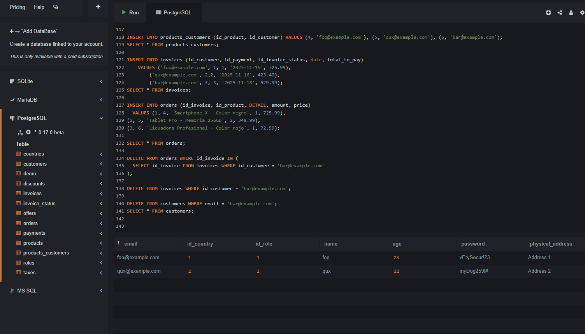

    DELETE FROM orders WHERE id_invoice IN (
    SELECT id_invoice FROM invoices WHERE id_custumer = 'bar@example.com'
    );

    DELETE FROM invoices WHERE id_custumer = 'bar@example.com';

    DELETE FROM customers WHERE email = 'bar@example.com';
    SELECT * from customers;

#### UPDATE LAST USER

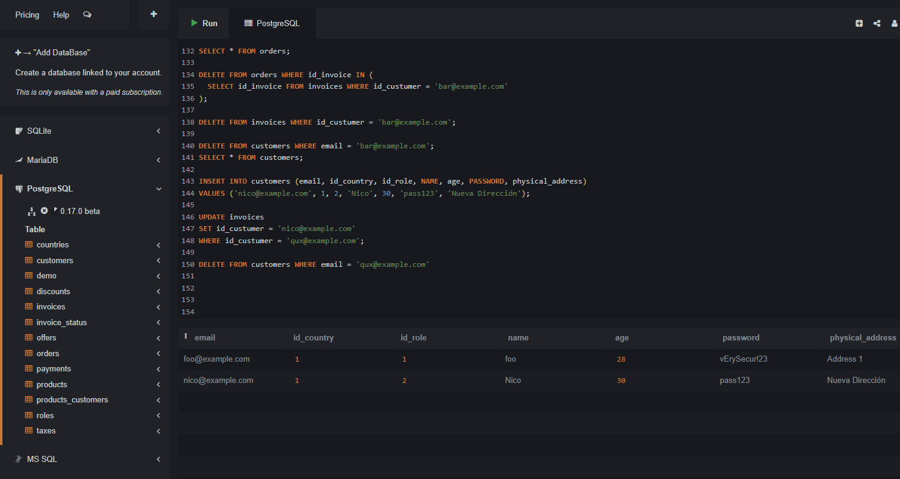

    INSERT INTO customers (email, id_country, id_role, name, age, password, physical_address)
    VALUES ('nico@example.com', 1, 2, 'Nico', 30, 'pass123', 'Nueva Dirección');

    UPDATE invoices
    SET id_custumer = 'nico@example.com'
    WHERE id_custumer = 'qux@example.com';

    delete from customers where email = 'qux@example.com'

#### UPDATE ALL TAXES

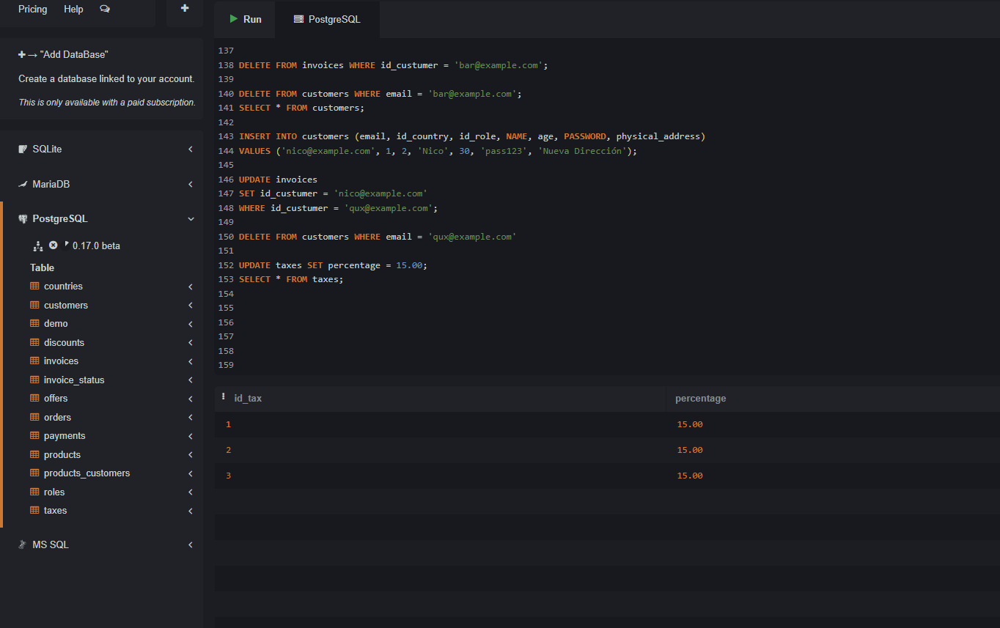

    UPDATE taxes set percentage = 15.00;
    select * from taxes;

#### UPDATE ALL PRICES

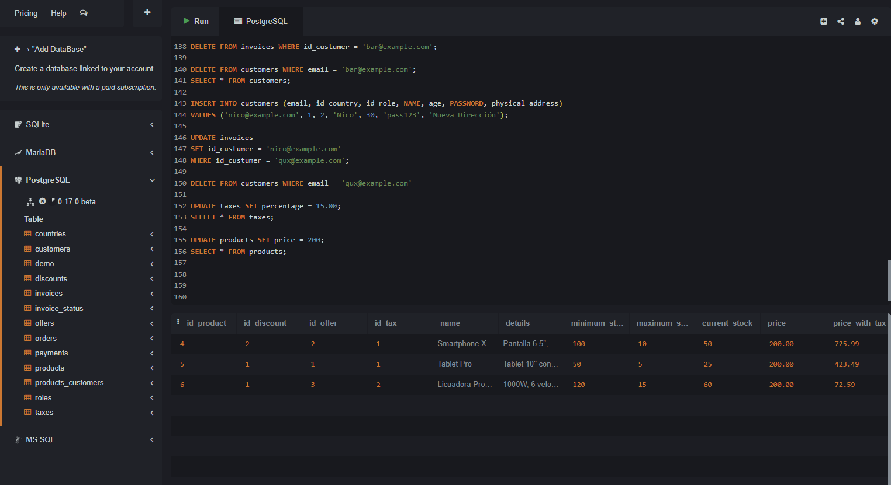

    update products set price = 200;
    SELECT * from products;
